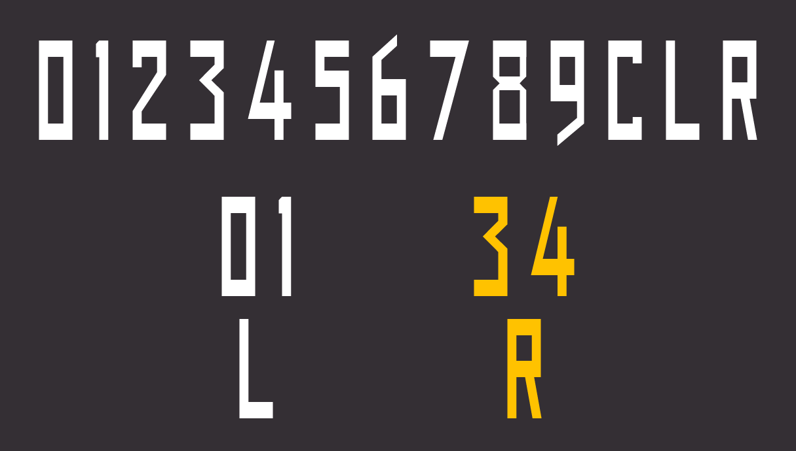

# Open Runway Fonts

**[日本語版はこちら](./README_JP.md)**

**Open Runway Fonts** is an open-source font pack that imitates runway related characters. All font files in this pack are under CC0 license and SIL Open Font License, so you can use them completely free.

## Fonts in this pack

### Open Runway Numbers



The font imitates the runway number characters as defined in ICAO Annex 14. This includes the following glyphs.

```
0 1 2 3 4 5 6 7 8 9 C L R
```

For latin alphabets, this includes only capital L, C and R. They are parallel runways. 

Kerning is also based on ICAO Annex 14.

The original design source: *Figure 5-3 (Form and proportions of numbers and letters for runway designation markings)* in *ICAO Annex 14 - Aerodromes*


### (Beta) Open Taxiway Mandatory Sign


The font imitates *MANDATORY INSTRUCTION MARKINGS* in ICAO Annex 14.

This includes the following glyphs.

```
A B C D E F G H I J K L M N O P Q R S T U V W X Y Z 
0 1 2 3 4 5 6 7 8 9 - /
```

Also this includes some Roman numerals for ILS Category and arrows. However, they are currently assigned to different character codes due to the restriction of the software. This problem is going to be fixed in the future version.

```
Ⅰ as ! (Shift + 1)
Ⅱ as @ (Shift + 2)
Ⅲ as # (Shift + 3)
← as a
↑ as w
→ as d
↓ as s
↖ as q 
↗ as e
```

This font doesn't include Latin Small alphabets but these characters have "space" (blank) glyphs to avoid switching fonts in Illustrator and so on.

The original design source: *APPENDIX 3. MANDATORY INSTRUCTION MARKINGS AND INFORMATION MARKINGS*  in *ICAO Annex 14 - Aerodromes*

### (WIP) Open Taxiway Guidance Sign

The font imitates *TAXIING GUIDANCE SIGNS* in ICAO Annex 14.

This will be released in the near future. Stay tuned!

## License

All fonts in this pack are under CC0 or SIL Open Font License (dual license). You can use them in any medium, including web, print, video and embedded in software/hardware. You also can redistribute these fonts. You don't need to contact the author.

However, please note these fonts are not intended for use in actual aircraft and airport operations. 

## Download

Download the latest version from the [Releases](https://github.com/ryo-a/Open-Runway-Fonts/releases) page of this repository.

## Contributors

Thanks to [Nanairo](https://at.tumblr.com/7-typ/67d6e4v0g9hk) for checking and advising on the metrics of the Open Taxiway Mandatory Sign. I would like to express my gratitude.